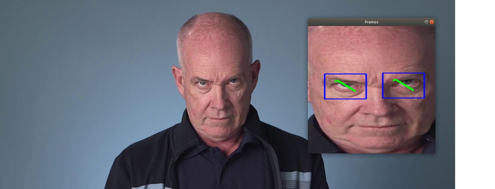

# Computer Pointer Controller

| Details of Software |                    |                   
|---------------------|--------------------|
| OS:                 | Ubuntu\* 18.04 LTS |
| OpenVINO:           | 2020.3 LTS         |
| Python:             |  3.6.9             |

## Introduction

The app of Computer Pointer Controller is applied to control the movement of mouse pointer by using gaze detection points.

It is a demonstration to perform complete OpenVINO pipeline from leveraging a pre-trained model with Intel® open model zoo (conduct model optimization if necessary), programming for the preprocessing and post-processing steps to proceed inference, and finally deploy to the edge.

Specifically, we’ll be using 4 different models as following to run this application, which will be detailed addressed further.

- Face Detection Model
- Facial Landmarks Detection Model
- Head Pose Estimation Model
- Gaze Estimation Model


## Project Set Up and Installation

### Prerequisites
Check out this [link](https://software.intel.com/content/www/us/en/develop/tools/openvino-toolkit/download.html#operatingsystem=Linux*&#distributions=Web%20Download&#options=Online) to get the Intel® Distribution of OpenVINO™ Toolkit. The detailed guide of installing it for Linux* OS can be referred to [here](https://docs.openvinotoolkit.org/latest/openvino_docs_install_guides_installing_openvino_linux.html).


Once the installation has been successfully done, make sure to check all of the modules met the requirements before building this project.
```
pip3 install -r requirements.txt
```

### Build
#### Step 1: Clone this repository to your workspace
```
git clone https://github.com/jonathanyeh0723/OpenVINO_Computer_Pointer_Controller
```

#### Step 2: Source the OpenVINO environment
```
source /opt/intel/openvino/bin/setupvars.sh
```
We should be able to see the following returned, if successful:
```
[setupvars.sh] OpenVINO environment initialized
```

#### Step 3: Download the following models by utilizing the model downloader from deep learning toolkit.
- Face Detection Model
```
python3 /opt/intel/openvino/deployment_tools/tools/model_downloader/downloader.py --name face-detection-retail-0004
```

- Facial Landmarks Detection Model:
```
python3 /opt/intel/openvino/deployment_tools/tools/model_downloader/downloader.py --name landmarks-regression-retail-0009
```

- Head Pose Estimation Model:
```
python3 /opt/intel/openvino/deployment_tools/tools/model_downloader/downloader.py --name landmarks-regression-retail-0009
```

- Gaze Estimation Model
```
python3 /opt/intel/openvino/deployment_tools/tools/model_downloader/downloader.py --name gaze-estimation-adas-0002
```

## Demo
Open a new terminal, change to the directory including main function and .py files.
```
cd OpenVINO_Computer_Pointer_Controller/src/
```

Ensure OpenVINO environment initialized.
```
source /opt/intel/openvino/bin/setupvars.sh
```

Run the demo.
```
python3 main.py \
        -fd /home/intel/OpenVINO_Computer_Pointer_Controller/intel/face-detection-retail-0004/FP32/face-detection-retail-0004.xml \
        -fl /home/intel/OpenVINO_Computer_Pointer_Controller/intel/landmarks-regression-retail-0009/FP32/landmarks-regression-retail-0009.xml \
        -hp /home/intel/OpenVINO_Computer_Pointer_Controller/intel/head-pose-estimation-adas-0001/FP32/head-pose-estimation-adas-0001.xml \
        -ge /home/intel/OpenVINO_Computer_Pointer_Controller/intel/gaze-estimation-adas-0002/FP32/gaze-estimation-adas-0002.xml \
        -i ../bin/demo.mp4 \
        -s fd fld hp ge
```

We should be able to see the demo video popped-out and related info reflected on the console:



```
[ INFO ] Start inferencing...
[ INFO ] Executed demo successfully.
[ INFO ] Model loading time: 0.326 seconds
[ INFO ] Inference time: 22.910 seconds
[ INFO ] FPS: 2.575 seconds
```

## Documentation

### Command Line Arguments

To get to know how to use the arguments, run python3 main.py -h from the command line:
```
usage: main.py [-h] -fd FACEDETECTIONMODEL -fl FACIALLANDMARKMODEL -hp
               HEADPOSEMODEL -ge GAZEESTIMATIONMODEL -i INPUT [-d DEVICE]
               [-l CPU_EXTENSION] [-pt PROB_THRESHOLD] [-s SHOW [SHOW ...]]

optional arguments:
  -h, --help            show this help message and exit
  -fd FACEDETECTIONMODEL, --facedetectionmodel FACEDETECTIONMODEL
                        Required. Path to .xml file with Face Detection model.
  -fl FACIALLANDMARKMODEL, --faciallandmarkmodel FACIALLANDMARKMODEL
                        Required. Path to .xml file with Facial Landmark
                        Detection model.
  -hp HEADPOSEMODEL, --headposemodel HEADPOSEMODEL
                        Required. Path to .xml file with Head Pose Estimation
                        model.
  -ge GAZEESTIMATIONMODEL, --gazeestimationmodel GAZEESTIMATIONMODEL
                        Required. Path to .xml file with Gaze Estimation
                        model.
  -i INPUT, --input INPUT
                        Required. To specify input video or webcam
  -d DEVICE, --device DEVICE
                        To specify target device for inference
  -l CPU_EXTENSION, --cpu_extension CPU_EXTENSION
                        MKLDNN (CPU)-targeted custom layers. Absolute path to
                        a shared library with the kernels impl.
  -pt PROB_THRESHOLD, --prob_threshold PROB_THRESHOLD
                        Probability threshold for detections filtering
  -s SHOW [SHOW ...], --show SHOW [SHOW ...]
                        To show the inference results. Use example: -s fd fld
                        hp ge; fd for Face Detection, fld for Facial Landmark
                        Detection, hp for Head Pose Estimation, ge for Gaze
```

### Directory Structure
There are lots of files contained in this folder and its subdirectories, we can run tree to see an overview:

```
.
├── bin
│   └── demo.mp4
├── intel
│   ├── face-detection-retail-0004
│   │   ├── FP16
│   │   │   ├── face-detection-retail-0004.bin
│   │   │   └── face-detection-retail-0004.xml
│   │   ├── FP16-INT8
│   │   │   ├── face-detection-retail-0004.bin
│   │   │   └── face-detection-retail-0004.xml
│   │   └── FP32
│   │       ├── face-detection-retail-0004.bin
│   │       └── face-detection-retail-0004.xml
│   ├── gaze-estimation-adas-0002
│   │   ├── FP16
│   │   │   ├── gaze-estimation-adas-0002.bin
│   │   │   └── gaze-estimation-adas-0002.xml
│   │   ├── FP16-INT8
│   │   │   ├── gaze-estimation-adas-0002.bin
│   │   │   └── gaze-estimation-adas-0002.xml
│   │   └── FP32
│   │       ├── gaze-estimation-adas-0002.bin
│   │       └── gaze-estimation-adas-0002.xml
│   ├── head-pose-estimation-adas-0001
│   │   ├── FP16
│   │   │   ├── head-pose-estimation-adas-0001.bin
│   │   │   └── head-pose-estimation-adas-0001.xml
│   │   ├── FP16-INT8
│   │   │   ├── head-pose-estimation-adas-0001.bin
│   │   │   └── head-pose-estimation-adas-0001.xml
│   │   └── FP32
│   │       ├── head-pose-estimation-adas-0001.bin
│   │       └── head-pose-estimation-adas-0001.xml
│   └── landmarks-regression-retail-0009
│       ├── FP16
│       │   ├── landmarks-regression-retail-0009.bin
│       │   └── landmarks-regression-retail-0009.xml
│       ├── FP16-INT8
│       │   ├── landmarks-regression-retail-0009.bin
│       │   └── landmarks-regression-retail-0009.xml
│       └── FP32
│           ├── landmarks-regression-retail-0009.bin
│           └── landmarks-regression-retail-0009.xml
├── requirements.txt
├── resources
│   ├── openvino.jpg
│   ├── pipeline.png
│   └── screenshot.jpg
└── src
    ├── face_detection.py
    ├── facial_landmarks_detection.py
    ├── gaze_estimation.py
    ├── head_pose_estimation.py
    ├── input_feeder.py
    ├── main.py
    └── mouse_controller.py

20 directories, 36 files
```

### Used Models

#### [Face Detection Model](https://docs.openvinotoolkit.org/2018_R5/_docs_Retail_object_detection_face_sqnet10modif_ssd_0004_caffe_desc_face_detection_retail_0004.html)
Face detector based on SqueezeNet light (half-channels) as a backbone with a single SSD for indoor/outdoor scenes shot by a front-facing camera. The backbone consists of fire modules to reduce the number of computations. The single SSD head from 1/16 scale feature map has nine clustered prior boxes.

#### [Facial Landmarks Detection Model](https://docs.openvinotoolkit.org/latest/omz_models_intel_landmarks_regression_retail_0009_description_landmarks_regression_retail_0009.html)
This is a lightweight landmarks regressor for the Smart Classroom scenario. It has a classic convolutional design: stacked 3x3 convolutions, batch normalizations, PReLU activations, and poolings. Final regression is done by the global depthwise pooling head and FullyConnected layers. The model predicts five facial landmarks: two eyes, nose, and two lip corners.
